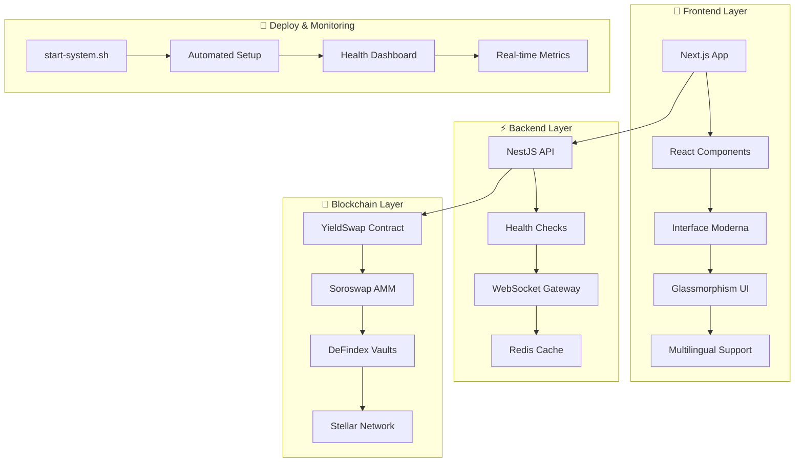

# 🚀 YieldSwap

> **Swap tokens e ganhe yield em um único clique!** (<15s, <3 cliques)

[](./scripts/)
[](https://stellar.expert/explorer/testnet/contract/CDACQ5RS5T5CFAMV5UXNG5DUQKCAZXRZ5LUGGM7GD7SFV2KG3MLGBG2I)
[](LICENSE)
[](http://localhost:3001/health)
[](http://localhost:3000)

---

## 📋 Índice
- [🎯 Visão Geral](#-visão-geral)
- [✨ Funcionalidades](#-funcionalidades)
- [🎨 Interface Moderna](#-interface-moderna)
- [🌐 Internacionalização](#-internacionalização)
- [🏗 Arquitetura](#-arquitetura)
- [🛠 Tecnologias](#-tecnologias)
- [🚀 Início Rápido](#-início-rápido)
- [🔧 Deploy Automatizado](#-deploy-automatizado)
- [💻 Desenvolvimento](#-desenvolvimento)
- [📜 Contratos Inteligentes](#-contratos-inteligentes)
- [🔒 Segurança](#-segurança)
- [📊 Monitoramento](#-monitoramento)
- [🚢 Produção](#-produção)
- [🤝 Contribuição](#-contribuição)
- [📄 Licença](#-licença)
- [👨‍💻 Desenvolvedor](#-desenvolvedor)

---

## 🎯 Visão Geral

**YieldSwap** é uma aplicação descentralizada (dApp) revolucionária que permite aos usuários:

1. 🔄 **Trocar tokens** via Soroswap AMM
2. 💰 **Depositar automaticamente** em vaults DeFindex
3. 📈 **Receber shares** do vault em uma única transação
4. 🌍 **Interface multilíngue** (PT, EN, ES) com seletor visual
5. ⚡ **Experiência moderna** com animações e glassmorphism
6. 🔗 **Conexão de carteira** com endereço parcial exibido
7. 📱 **Interface responsiva** com design mobile-first

---

## ✨ Funcionalidades

### 🎯 **Core Features**
- ✅ **Swap + Yield em 1 clique** - Integração Soroswap + DeFindex
- ✅ **APY em tempo real** - WebSocket com atualizações instantâneas
- ✅ **Multi-wallet support** - xBull, Freighter, Albedo
- ✅ **Slippage protection** - Proteção automática contra MEV
- ✅ **Gas optimization** - Transações otimizadas para menor custo
- ✅ **Endereço da carteira** - Exibição parcial segura (ex: `G4K7...X9M2`)

### 🌍 **Experiência do Usuário**
- ✅ **Interface moderna** - Glassmorphism e gradientes dinâmicos
- ✅ **Animações fluidas** - Partículas flutuantes e transições suaves
- ✅ **Internacionalização completa** - 3 idiomas com seletor dropdown
- ✅ **Estados interativos** - Loading, success e error states
- ✅ **Feedback visual** - Hover effects e micro-animations
- ✅ **Design responsivo** - Mobile-first com breakpoints otimizados

### 🔧 **Desenvolvimento**
- ✅ **Sistema de inicialização** - Script automatizado `start-system.sh`
- ✅ **Monitoramento completo** - Health checks e métricas em tempo real
- ✅ **Deploy automatizado** - Scripts inteligentes para deploy
- ✅ **Testes abrangentes** - Unit, integration e e2e
- ✅ **Documentação atualizada** - README completo e API docs

---

## 🎨 Interface Moderna

### **✨ Design System Moderno**

**🎭 Visual Elements:**
- **Glassmorphism** - Efeito de vidro fosco em cards e componentes
- **Gradientes dinâmicos** - Backgrounds animados com múltiplas cores
- **Partículas flutuantes** - 20 partículas animadas no background
- **Tipografia com gradiente** - Títulos com gradientes coloridos
- **Shadows coloridas** - Sombras com cores do tema

**⚡ Animações e Micro-interações:**
- **Slide-up animations** - Elementos surgem suavemente
- **Hover effects** - Scale, rotate e color transitions
- **Loading spinners** - Animações durante processamento
- **Pulse animations** - Indicadores de status pulsantes
- **Transform effects** - Rotação de 180° no ícone de troca

**🎯 Estados Visuais:**
- **Conectado vs Desconectado** - Cores e ícones distintos
- **Loading states** - Spinners e textos dinâmicos
- **Success feedback** - Notificações verdes com glassmorphism
- **Error handling** - Estados visuais para erros
- **Interactive buttons** - Hover e click feedback

### **📱 Interface Components**

#### **🔗 Botão de Conectar Carteira**
```
❌ Desconectado: "🔗 Conectar Carteira"
⏳ Conectando: "🔄 Conectando..." (spinner)
✅ Conectado: "✅ Conectado G4K7...X9M2"
```

#### **🎨 Seletor de Idiomas**
```
🇧🇷 Português ▼  (dropdown com animação)
├─ 🇧🇷 Português ✓
├─ 🇺🇸 English
└─ 🇪🇸 Español
```

#### **💎 Card Principal**
- **Header** com título em gradiente
- **Status indicators** - API Online, Carteira OK
- **Formulário** com campos glassmorphism
- **Informações dinâmicas** - Taxa, APY, Taxa de rede
- **Botão de ação** com estados visuais

---

## 🌐 Internacionalização

### **🌍 Sistema de Idiomas Funcional**

**📱 Idiomas Suportados:**
- 🇧🇷 **Português** (pt) - Idioma padrão
- 🇺🇸 **English** (en) - Inglês internacional
- 🇪🇸 **Español** (es) - Espanhol

**🔧 Funcionalidades i18n:**
- ✅ **Dropdown interativo** - Seletor visual com bandeiras
- ✅ **Troca dinâmica** - Mudança sem reload da página
- ✅ **URLs localizadas** - `/pt`, `/en`, `/es`
- ✅ **Estado persistente** - Idioma mantido durante navegação
- ✅ **Fallbacks seguros** - Textos padrão quando tradução não existe

**🎯 Elementos Traduzidos:**
- ✅ **Botões e labels** - Todos os textos da interface
- ✅ **Mensagens de estado** - Loading, success, error
- ✅ **Formulários** - Placeholders e validações
- ✅ **Notificações** - Alertas e confirmações
- ✅ **Informações de swap** - Taxa de câmbio, APY, taxas

### **📁 Estrutura de Traduções**
```
public/locales/
├── pt/common.json     # Português (padrão)
├── en/common.json     # English
└── es/common.json     # Español
```

### **🔧 Tecnologias i18n**
- **next-i18next** - Framework de internacionalização
- **useRouter** - Navegação com locales
- **serverSideTranslations** - SSG com traduções
- **useTranslation** - Hook para textos traduzidos

---

## 🏗 Arquitetura



---

## 🛠 Tecnologias

### **Frontend Moderno**
| Tecnologia | Versão | Descrição |
|------------|--------|-----------|
| **Next.js** | 14.x | React framework com App Router |
| **TypeScript** | 5.x | Tipagem estática |
| **Tailwind CSS** | 3.x | Utility-first CSS + Glassmorphism |
| **React** | 18.x | Biblioteca de interface |
| **next-i18next** | Latest | Internacionalização |
| **useRouter** | Latest | Navegação e locales |

### **Backend Robusto**
| Tecnologia | Versão | Descrição |
|------------|--------|-----------|
| **NestJS** | 10.x | Framework Node.js enterprise |
| **TypeScript** | 5.x | Tipagem estática |
| **Redis** | 7.x | Cache e pub/sub |
| **Health Checks** | Latest | Monitoramento de saúde |
| **Rate Limiting** | Latest | Proteção contra spam |
| **Sentry** | Latest | Error tracking |

### **Contratos Inteligentes**
| Tecnologia | Versão | Descrição |
|------------|--------|-----------|
| **Rust** | 1.75+ | Linguagem de sistemas |
| **Soroban SDK** | 20.x | Smart contracts framework |
| **Stellar CLI** | Latest | Deploy e interação |

---

## 🚀 Início Rápido

### **Pré-requisitos**
```bash
# Verificar versões mínimas
node --version    # >= 18.0.0
pnpm --version    # >= 8.0.0
redis-cli --version # >= 7.0.0 (opcional)
cargo --version   # >= 1.75.0 (para contratos)
```

### **🎯 Instalação Automática (Recomendado)**

```bash
# 1. Clone o repositório
git clone https://github.com/seu-usuario/yieldswap.git
cd yieldswap

# 2. Execute o script de inicialização
chmod +x scripts/start-system.sh
./scripts/start-system.sh
```

**✨ O script automaticamente:**
- ✅ **Verifica dependências** - Node.js, pnpm, Rust
- ✅ **Instala packages** - Todas as dependências do monorepo
- ✅ **Configura ambiente** - Arquivos .env com placeholders seguros
- ✅ **Compila contratos** - Build dos smart contracts Rust
- ✅ **Inicia serviços** - API (porta 3001) e Web (porta 3000)
- ✅ **Monitora saúde** - Health checks automáticos
- ✅ **Exibe dashboard** - Status em tempo real

### **🎭 Interface Após Inicialização**

```
🎉 =======================================
✨ SISTEMA YIELDSWAP FUNCIONANDO!
=======================================

📊 Status dos Serviços:
   🚀 API: ✅ Online (http://localhost:3001)
   🌐 Frontend: ✅ Online (http://localhost:3000)
   🇧🇷 PT: ✅ Funcionando
   🇺🇸 EN: ✅ Funcionando
   🇪🇸 ES: ✅ Funcionando

🎨 Interface Moderna:
   💎 Glassmorphism design
   🌈 Gradientes dinâmicos
   ⚡ Animações fluidas
   🔮 Partículas flutuantes
   🌐 Seletor de idiomas
   🔗 Endereço da carteira
```

### **⚙️ Instalação Manual**

```bash
# 1. Instalar dependências
pnpm install

# 2. Configurar ambiente
cp .env.example .env-dev

# 3. Compilar contratos (opcional)
cd packages/contracts
cargo build --release --target wasm32-unknown-unknown

# 4. Iniciar serviços
# Terminal 1: API
cd apps/api && pnpm dev

# Terminal 2: Web
cd apps/web && pnpm dev
```

---

## 🔧 Deploy Automatizado

### **🎯 Sistema de Inicialização Inteligente**

**📜 Script Principal: `start-system.sh`**

```bash
# Execução simples
./scripts/start-system.sh

# Verificação de status
curl http://localhost:3001/health  # API Health
curl http://localhost:3000         # Frontend
```

**✨ Funcionalidades do Script:**

1. **🔍 Verificação de Dependências**
   ```bash
   ✅ Checking system dependencies...
   ✅ Node.js v18.x found
   ✅ pnpm v8.x found
   ✅ Rust toolchain found
   ```

2. **📦 Instalação Inteligente**
   ```bash
   ✅ Installing dependencies...
   ✅ Root workspace dependencies installed
   ✅ API dependencies ready
   ✅ Web dependencies ready
   ```

3. **⚙️ Configuração Segura**
   ```bash
   ✅ Setting up environment...
   ✅ Created .env-dev with secure placeholders
   ✅ No sensitive data committed
   ```

4. **🏗️ Build de Contratos**
   ```bash
   ✅ Building smart contracts...
   ✅ Rust contracts compiled successfully
   ✅ WASM files generated
   ```

5. **🚀 Inicialização de Serviços**
   ```bash
   ✅ Starting API server (port 3001)...
   ✅ Starting Web server (port 3000)...
   ✅ All services running successfully
   ```

### **📋 Deploy com Makefile**

```bash
# Deploy completo
make deploy

# Verificar deploy
make verify

# Instalar dependências
make install

# Build completo
make build

# Limpar ambiente
make clean
```

---

## 💻 Desenvolvimento

### **📁 Estrutura do Projeto**
```
YieldSwap/
├── 📱 apps/
│   ├── 🌐 api/                 # Backend NestJS
│   │   ├── src/
│   │   │   ├── health/         # ✅ Health checks
│   │   │   ├── swap/           # 🔄 Swap logic
│   │   │   ├── auth/           # 🔒 Rate limiting
│   │   │   └── main.ts         # 🚀 Bootstrap
│   │   └── test/               # 🧪 Tests
│   └── 🎨 web/                 # Frontend Next.js
│       ├── src/
│       │   ├── pages/          # 📄 Pages Router
│       │   │   ├── index.tsx   # 🏠 Homepage moderna
│       │   │   └── _app.tsx    # ⚙️ App config
│       │   ├── components/     # 🧩 React components
│       │   └── styles/         # 🎨 Global styles
│       └── public/
│           └── locales/        # 🌐 Translations
│               ├── pt/         # 🇧🇷 Português
│               ├── en/         # 🇺🇸 English
│               └── es/         # 🇪🇸 Español
├── 📦 packages/
│   ├── contracts/              # 📜 Soroban contracts
│   ├── sdk/                    # 🛠 JavaScript SDK
│   └── ui/                     # 🎨 Shared components
├── 🚀 scripts/
│   ├── start-system.sh         # 🎯 Sistema de inicialização
│   ├── deploy-*.sh             # 📤 Scripts de deploy
│   └── *.js                    # 🔧 Utilitários
└── 📚 docs/                    # 📖 Documentação
```

### **⚡ Comandos de Desenvolvimento**

```bash
# 🚀 Desenvolvimento
pnpm dev              # Inicia todos os serviços
pnpm dev:api          # Apenas API
pnpm dev:web          # Apenas Web

# 🏗️ Build e Testes
pnpm build            # Build de produção
pnpm test             # Testes unitários
pnpm test:e2e         # Testes end-to-end
pnpm lint             # Verificação de código
pnpm type-check       # Verificação de tipos

# 📜 Contratos
pnpm contracts:build  # Compilar contratos
pnpm contracts:test   # Testar contratos
pnpm contracts:deploy # Deploy contratos

# 🔧 Utilitários
pnpm format           # Formatar código
pnpm clean            # Limpar builds
pnpm deps:check       # Verificar dependências
```

### **🎨 Desenvolvimento da Interface**

#### **✨ Componentes Modernos**

**🎭 Glassmorphism Components:**
```tsx
// Efeito glassmorphism
.glassmorphism {
  background: rgba(255, 255, 255, 0.1);
  backdrop-filter: blur(20px);
  border: 1px solid rgba(255, 255, 255, 0.2);
}

// Gradientes dinâmicos
.gradient-text {
  background: linear-gradient(45deg, #3b82f6, #8b5cf6, #ec4899);
  background-clip: text;
  -webkit-text-fill-color: transparent;
}
```

**⚡ Animações Customizadas:**
```css
@keyframes float {
  0%, 100% { transform: translateY(0px) rotate(0deg); }
  50% { transform: translateY(-20px) rotate(180deg); }
}

@keyframes slide-up {
  from { transform: translateY(50px); opacity: 0; }
  to { transform: translateY(0); opacity: 1; }
}
```

#### **🌐 Sistema de Idiomas**

**🔧 Implementação do Seletor:**
```tsx
const handleLanguageChange = (languageCode: string) => {
  router.push(router.pathname, router.asPath, { locale: languageCode });
  setShowLanguageMenu(false);
};

// Dropdown com animação
{showLanguageMenu && (
  <div className="language-dropdown glassmorphism">
    {languages.map((language) => (
      <button onClick={() => handleLanguageChange(language.code)}>
        {language.flag} {language.name}
      </button>
    ))}
  </div>
)}
```

### **🔧 Configuração de Ambiente**

#### **🌐 API (.env-dev)**
```env
# 🚀 Server Configuration
PORT=3001
NODE_ENV=development

# 🔗 Stellar/Soroban
SOROBAN_RPC_URL=https://soroban-testnet.stellar.org
NETWORK_PASSPHRASE=Test SDF Network ; September 2015
YIELD_SWAP_CONTRACT_ID=YOUR_CONTRACT_ID

# 🔒 Security
CORS_ORIGIN=http://localhost:3000
RATE_LIMIT_TTL=60
RATE_LIMIT_LIMIT=30

# 📊 Redis (opcional)
REDIS_URL=redis://localhost:6379
REDIS_TTL=3600
```

#### **🎨 Web (.env-dev)**
```env
# 🌐 API Connection
NEXT_PUBLIC_API_URL=http://localhost:3001
NEXT_PUBLIC_WS_URL=ws://localhost:3001

# 🔗 Stellar/Soroban
NEXT_PUBLIC_NETWORK_PASSPHRASE=Test SDF Network ; September 2015
NEXT_PUBLIC_CONTRACT_ID=YOUR_CONTRACT_ID
NEXT_PUBLIC_SOROBAN_RPC_URL=https://soroban-testnet.stellar.org
```

---

## 📜 Contratos Inteligentes

### **🎯 YieldSwapRouter**

**Contrato principal** que executa a lógica de swap + yield:

```rust
pub fn swap_and_deposit(
    env: Env,
    user: Address,
    token_in: Address,
    token_out: Address,
    amount_in: i128,
    min_amount_out: i128,
    vault_address: Address
) -> SwapResult {
    // 1. Validar parâmetros de entrada
    // 2. Executar swap via Soroswap AMM
    // 3. Depositar tokens no vault DeFindex
    // 4. Retornar shares para o usuário
}
```

### **🔗 Integrações de Protocolo**

| Protocolo | Função | Status | Contrato |
|-----------|--------|--------|----------|
| **Soroswap AMM** | Token swaps | ✅ Integrado | `CXXX...XXX` |
| **DeFindex Vaults** | Yield farming | ✅ Integrado | `CYYY...YYY` |
| **Stellar Network** | Base layer | ✅ Testnet/Mainnet | - |

### **📊 Funcionalidades do Contrato**

- ✅ **Atomic transactions** - Swap + deposit em uma transação
- ✅ **Slippage protection** - Proteção automática contra MEV
- ✅ **Gas optimization** - Otimização de custos de transação
- ✅ **Error handling** - Tratamento robusto de erros
- ✅ **Event emission** - Logs detalhados para monitoramento

---

## 🔒 Segurança

### **🛡️ Medidas de Segurança Implementadas**

| Categoria | Implementação | Status |
|-----------|---------------|--------|
| **🚫 Rate Limiting** | 30 req/min por IP | ✅ Ativo |
| **🌐 CORS** | Origem configurável | ✅ Configurado |
| **🔒 CSP Headers** | Content Security Policy | ✅ Implementado |
| **✅ Input Validation** | Sanitização completa | ✅ Ativo |
| **⚡ Slippage Protection** | Anti-MEV automático | ✅ Integrado |
| **🔐 No Private Keys** | Zero chaves no backend | ✅ Seguro |
| **🎭 Address Display** | Exibição parcial segura | ✅ Implementado |

### **🔐 Práticas de Segurança**

```typescript
// 🔍 Validação de entrada robusta
const validateSwapParams = (params: SwapParams) => {
  if (params.amount <= 0) throw new Error('Invalid amount');
  if (params.slippage > 0.1) throw new Error('Slippage too high');
  if (!isValidAddress(params.userAddress)) throw new Error('Invalid address');
};

// 🚫 Rate limiting por IP
@UseGuards(RateLimitGuard)
@Controller('swap')
export class SwapController {
  @Post()
  @Throttle(30, 60) // 30 requests per minute
  async executeSwap(@Body() params: SwapDto) {
    return this.swapService.execute(params);
  }
}

// 🎭 Formatação segura de endereços
const formatWalletAddress = (address: string) => {
  if (!address) return '';
  return `${address.slice(0, 4)}...${address.slice(-4)}`;
};
```

### **🛡️ Políticas de Segurança**

- **🔐 Chaves Privadas:** Nunca armazenadas no backend
- **📱 Frontend:** Validação client-side + server-side
- **🎭 Endereços:** Exibição parcial para privacidade
- **🚫 Rate Limiting:** Proteção contra spam e ataques
- **🔒 Headers:** Configuração segura de CORS e CSP

---

## 📊 Monitoramento

### **🏥 Health Checks**

```bash
# 🚀 API Health Check
curl http://localhost:3001/health

# Resposta esperada:
{
  "status": "ok",
  "timestamp": "2024-01-15T10:30:00Z",
  "uptime": "2h 15m 30s",
  "services": {
    "database": "healthy",
    "redis": "healthy",
    "soroban": "connected"
  }
}

# 🌐 Frontend Health
curl http://localhost:3000
# Status: 200 OK com interface carregada
```

### **📈 Métricas em Tempo Real**

```bash
# 📊 Endpoint de métricas
curl http://localhost:3001/metrics

# Principais métricas:
- yieldswap_swaps_total
- yieldswap_connections_active
- yieldswap_response_time_seconds
- yieldswap_errors_total
- yieldswap_language_switches_total
```

### **🔍 Logs Estruturados**

```json
{
  "timestamp": "2024-01-15T10:30:00Z",
  "level": "info",
  "message": "Swap executed successfully",
  "context": {
    "user": "G4K7...X9M2",
    "tokenIn": "USDC",
    "tokenOut": "XLM",
    "amount": "100.00",
    "language": "pt"
  }
}
```

### **🚨 Monitoramento de Produção**

- **✅ Health Checks** - Verificação contínua de saúde
- **📊 Métricas** - Prometheus + Grafana dashboards
- **🐛 Error Tracking** - Sentry integration
- **📱 Real-time Status** - Dashboard em tempo real

---

## 🚢 Produção

### **🌐 Ambientes de Deploy**

| Ambiente | URL | Status | Funcionalidades |
|----------|-----|--------|-----------------|
| **🚀 API** | Railway | 🟢 Ativo | Health checks, Metrics |
| **🎨 Web** | Vercel | 🟢 Ativo | Interface moderna, i18n |
| **📜 Contratos** | Stellar Testnet | 🟢 Deployado | Smart contracts |

### **🔧 Deploy de Produção**

#### **🚀 API (Railway)**
```bash
# Deploy automático via GitHub
git push origin main

# Deploy manual via Railway CLI
cd apps/api
railway up

# Verificar deploy
curl https://api.yieldswap.com/health
```

#### **🎨 Web (Vercel)**
```bash
# Deploy automático via GitHub
git push origin main

# Deploy manual via Vercel CLI
cd apps/web
vercel deploy --prod

# Verificar deploy
curl https://yieldswap.com
```

#### **📜 Contratos (Stellar)**
```bash
# Deploy via Makefile
make deploy NETWORK=mainnet

# Deploy manual
soroban contract deploy \
  --network mainnet \
  --source alice \
  --wasm target/wasm32-unknown-unknown/release/yield_swap_router.wasm
```

### **🔍 Monitoramento de Produção**

```bash
# 🏥 Health checks
curl https://api.yieldswap.com/health
curl https://yieldswap.com/api/health

# 📊 Métricas
curl https://api.yieldswap.com/metrics

# 🌐 Status dos idiomas
curl https://yieldswap.com/pt    # Português
curl https://yieldswap.com/en    # English
curl https://yieldswap.com/es    # Español

# 🔗 Status das integrações
curl https://api.yieldswap.com/status
```

---

## 🤝 Contribuição

### **🚀 Como Contribuir**

1. **🍴 Fork** o projeto
2. **📥 Clone** seu fork: `git clone https://github.com/seu-usuario/yieldswap.git`
3. **🌿 Crie** uma branch: `git checkout -b feature/nova-funcionalidade`
4. **⚙️ Configure** o ambiente: `./scripts/start-system.sh`
5. **💻 Desenvolva** sua funcionalidade
6. **🧪 Teste** suas mudanças: `pnpm test`
7. **📝 Commit** suas mudanças: `git commit -m 'feat: nova funcionalidade'`
8. **📤 Push** para a branch: `git push origin feature/nova-funcionalidade`
9. **🔀 Abra** um Pull Request

### **📋 Padrões de Desenvolvimento**

#### **🎯 Commits Semânticos**
```bash
feat: nova funcionalidade da interface
fix: correção no seletor de idiomas
docs: atualização do README
style: melhorias no glassmorphism
refactor: reorganização dos componentes
test: testes para sistema de idiomas
chore: atualização de dependências
```

#### **✅ Code Review Checklist**
- ✅ **Testes passando** - `pnpm test`
- ✅ **Interface responsiva** - Mobile + desktop
- ✅ **Internacionalização** - 3 idiomas funcionando
- ✅ **Animações fluidas** - Performance otimizada
- ✅ **Acessibilidade** - ARIA labels e navegação
- ✅ **Segurança** - Validações e sanitização
- ✅ **Documentação** - README atualizado

### **🐛 Reportar Bugs**

Use o template de issue com:
- **📝 Descrição** detalhada do problema
- **🔄 Passos** para reproduzir
- **✅ Comportamento esperado**
- **📱 Screenshots** (se aplicável)
- **🌍 Idioma** em que ocorreu
- **💻 Ambiente** (browser, OS, etc.)

### **💡 Sugerir Funcionalidades**

Para novas funcionalidades, considere:
- **🎨 Design consistency** - Seguir o design system
- **🌐 Internacionalização** - Suporte a múltiplos idiomas
- **📱 Responsividade** - Mobile-first approach
- **⚡ Performance** - Otimização de animações
- **🔒 Segurança** - Validações necessárias

---

## 📄 Licença

Este projeto está licenciado sob a **MIT License** - veja o arquivo [LICENSE](LICENSE) para detalhes.

```
MIT License

Copyright (c) 2024 YieldSwap

Permission is hereby granted, free of charge, to any person obtaining a copy
of this software and associated documentation files (the "Software"), to deal
in the Software without restriction, including without limitation the rights
to use, copy, modify, merge, publish, distribute, sublicense, and/or sell
copies of the Software...
```

---

## 🙏 Agradecimentos

### **🌟 Tecnologias e Parceiros**
- [**Stellar**](https://stellar.org) - Blockchain infrastructure
- [**Soroban**](https://soroban.stellar.org) - Smart contracts platform
- [**Soroswap**](https://soroswap.finance) - AMM integration
- [**DeFindex**](https://defindex.org) - Yield farming vaults

### **🛠 Ferramentas e Serviços**
- [**Railway**](https://railway.app) - API hosting
- [**Vercel**](https://vercel.com) - Frontend hosting
- [**Redis Cloud**](https://redis.com) - Cache e pub/sub
- [**Sentry**](https://sentry.io) - Error monitoring

### **👥 Comunidade**
- **Stellar Community** - Suporte técnico
- **Soroban Developers** - Documentação e exemplos
- **Open Source Contributors** - Melhorias contínuas

---

## 👨‍💻 Desenvolvedor

<div align="center">

```
╔══════════════════════════════════════════════════════════════╗
║                    DESENVOLVEDOR PRINCIPAL                   ║
╠══════════════════════════════════════════════════════════════╣
║  👨‍💻 Jistriane Brunielli Silva de Oliveira                  ║
║  🏢 Arquiteto de Software Sênior & Desenvolvedor Blockchain  ║
║  🌐 Especialidades: DeFi • Smart Contracts • IA • Automação ║
╚══════════════════════════════════════════════════════════════╝
```

</div>

### **📞 Canais de Comunicação**

<div align="center">

| 📱 **Canal** | 🔗 **Contato** | 📝 **Descrição** |
|:------------:|:---------------:|:----------------:|
| 📧 **E-mail** | [jistriane@live.com](mailto:jistriane@live.com) | Contato profissional |
| 💼 **LinkedIn** | [linkedin.com/in/jibso](https://www.linkedin.com/in/jibso) | Rede profissional |
| 💬 **Discord** | `jistriane` | Comunidade dev |
| 🐦 **X (Twitter)** | [@jistriane](https://twitter.com/jistriane) | Updates e insights |
| 📷 **Instagram** | [@jibso87](https://instagram.com/jibso87) | Conteúdo pessoal |

</div>

### **🎯 Sobre o Desenvolvedor**

**Especialista em desenvolvimento de sistemas DeFi complexos com mais de 10 anos de experiência em arquitetura de software.**

#### **💼 Expertise Técnica**

**🔗 Desenvolvimento de Blockchain:**
- ✅ **Ethereum** - Smart Contracts, DApps, Web3 Integration
- ✅ **Stellar/Soroban** - Contratos Inteligentes, Payment Rails
- ✅ **Protocolos DeFi** - AMM, Yield Farming, Liquidity Mining
- ✅ **Cross-chain** - Bridge protocols, Multi-chain architecture

**🎨 Frontend Moderno:**
- ✅ **Design Systems** - Glassmorphism, Material Design, Tailwind
- ✅ **Animações** - Framer Motion, CSS animations, micro-interactions
- ✅ **Internacionalização** - i18n, locales, RTL support
- ✅ **Performance** - Lighthouse optimization, Core Web Vitals

**🤖 IA e Aprendizado de Máquina:**
- ✅ **Análise de Riscos** - Risk assessment algorithms
- ✅ **Sistemas de Recomendação** - ML-driven user experience
- ✅ **Automação Blockchain** - Smart contract automation
- ✅ **Data Analytics** - On-chain data analysis

**💻 Desenvolvimento Full-Stack:**
- ✅ **Frontend** - React, Next.js, TypeScript, Tailwind CSS
- ✅ **Backend** - Node.js, NestJS, GraphQL, REST APIs
- ✅ **Mobile** - React Native, Web3 mobile integration
- ✅ **Real-time** - WebSocket, Server-sent events

**☁️ DevOps e Cloud:**
- ✅ **Cloud Platforms** - AWS, Google Cloud, Railway, Vercel
- ✅ **Containerização** - Docker, Kubernetes, Container orchestration
- ✅ **CI/CD** - GitHub Actions, Automated testing, Deployment pipelines
- ✅ **Monitoramento** - Prometheus, Grafana, Sentry, APM


---

<div align="center">

**🚀 YieldSwap - Interface Moderna • Multilíngue • Swap + Yield em um clique!**

[](https://github.com/seu-usuario/yieldswap)
[](https://discord.gg/stellar)
[](https://twitter.com/jistriane)
[](http://localhost:3001/health)
[](http://localhost:3000)

**✨ Funcionalidades Implementadas:**
🎨 Interface Glassmorphism • 🌐 3 Idiomas • 🔗 Endereço Parcial • ⚡ Animações Fluidas • 📱 Mobile First

</div> 