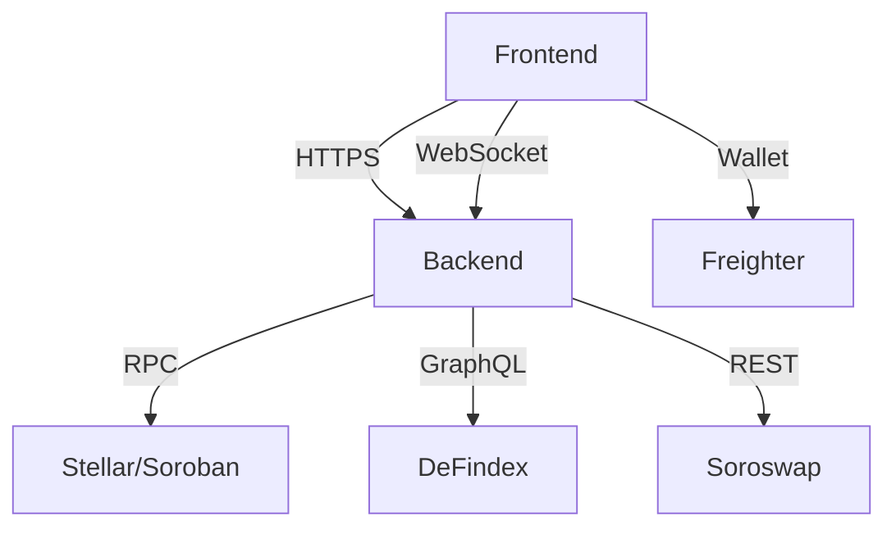
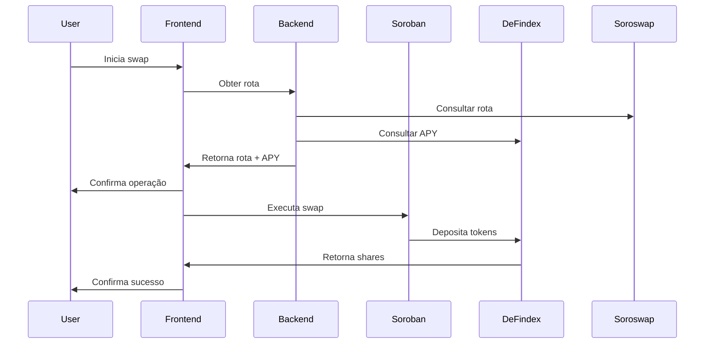
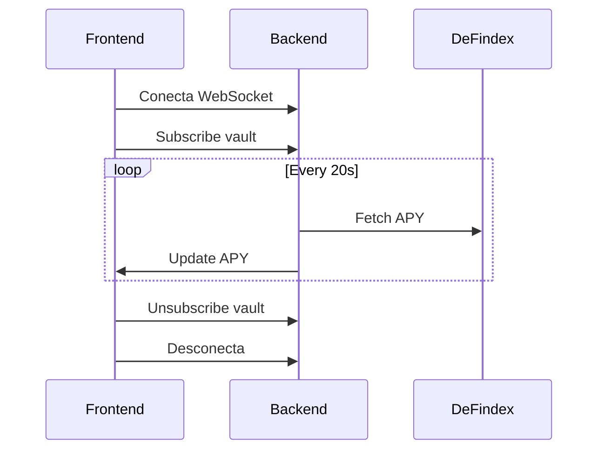

import { Meta } from '@storybook/addon-docs';

<Meta title="SDK/YieldSwap/Architecture" />

# YieldSwap SDK Architecture

## Visão Geral



## Componentes

### Frontend (Next.js)

```typescript
interface AppConfig {
  api: ApiConfig;
  websocket: WebSocketConfig;
  sentry?: SentryConfig;
}

class App {
  private sdk: YieldSwap;
  private i18n: I18n;
  private wallet: Wallet;

  constructor(config: AppConfig) {
    this.sdk = new YieldSwap(config);
    this.i18n = new I18n();
    this.wallet = new Wallet();
  }
}
```

### Backend (NestJS)

```typescript
@Module({
  imports: [
    ConfigModule.forRoot(),
    ThrottlerModule.forRoot([{
      ttl: 60000,
      limit: 30,
    }]),
    SwapModule,
    ApyModule,
    WebsocketModule,
  ],
})
export class AppModule {}
```

### Smart Contract (Soroban/Rust)

```rust
#[contract]
pub struct YieldSwapRouter {
    reentrancy_guard: bool,
}

#[contractimpl]
impl YieldSwapRouter {
    pub fn swap_and_deposit(
        env: Env,
        user: Address,
        path: Vec<Address>,
        amount_in: i128,
        min_out: i128,
        vault: Address,
    ) -> i128 {
        // ...
    }
}
```

## Fluxo de Dados

### Swap & Yield



### WebSocket



## Camadas

### Apresentação

```typescript
interface SwapFormProps {
  onSubmit: (values: SwapFormValues) => void;
  loading: boolean;
  error?: string;
}

function SwapForm({ onSubmit, loading, error }: SwapFormProps) {
  // ...
}
```

### Negócio

```typescript
class SwapService {
  async executeSwap(params: SwapParams): Promise<SwapResult> {
    // Validar parâmetros
    this.validateParams(params);

    // Obter rota
    const route = await this.getRoute(params);

    // Simular operação
    const simulation = await this.simulateSwap(route);

    // Executar swap
    const result = await this.executeTransaction(simulation);

    return result;
  }
}
```

### Dados

```typescript
interface Repository<T> {
  find(id: string): Promise<T>;
  findAll(): Promise<T[]>;
  create(data: T): Promise<T>;
  update(id: string, data: Partial<T>): Promise<T>;
  delete(id: string): Promise<void>;
}

class VaultRepository implements Repository<Vault> {
  // ...
}
```

## Padrões

### Observer (WebSocket)

```typescript
interface Observer {
  update(data: any): void;
}

class Subject {
  private observers: Observer[] = [];

  addObserver(observer: Observer): void {
    this.observers.push(observer);
  }

  removeObserver(observer: Observer): void {
    const index = this.observers.indexOf(observer);
    if (index > -1) {
      this.observers.splice(index, 1);
    }
  }

  notify(data: any): void {
    this.observers.forEach(observer => observer.update(data));
  }
}
```

### Factory (API)

```typescript
interface ApiClientFactory {
  createHttpClient(): HttpClient;
  createWebSocketClient(): WebSocketClient;
}

class ApiClientFactoryImpl implements ApiClientFactory {
  createHttpClient(): HttpClient {
    return new AxiosHttpClient();
  }

  createWebSocketClient(): WebSocketClient {
    return new SocketIOWebSocketClient();
  }
}
```

### Strategy (Cache)

```typescript
interface CacheStrategy {
  get<T>(key: string): Promise<T | null>;
  set<T>(key: string, value: T, ttl?: number): Promise<void>;
  delete(key: string): Promise<void>;
}

class RedisCacheStrategy implements CacheStrategy {
  // ...
}

class MemoryCacheStrategy implements CacheStrategy {
  // ...
}
```

## Segurança

### Autenticação

```typescript
interface AuthProvider {
  authenticate(): Promise<void>;
  getToken(): string | null;
  isAuthenticated(): boolean;
  logout(): Promise<void>;
}

class WalletAuthProvider implements AuthProvider {
  // ...
}
```

### Rate Limiting

```typescript
@Injectable()
export class RateLimiterGuard implements CanActivate {
  constructor(private readonly rateLimiter: RateLimiter) {}

  async canActivate(context: ExecutionContext): Promise<boolean> {
    const request = context.switchToHttp().getRequest();
    const ip = request.ip;

    return this.rateLimiter.checkLimit(ip);
  }
}
```

### Validação

```typescript
class SwapParamsValidator {
  validate(params: SwapParams): ValidationResult {
    return [
      this.validateAddress(params.address),
      this.validateAmount(params.amount),
      this.validateSlippage(params.slippage),
    ].filter(Boolean);
  }
}
```

## Monitoramento

### Métricas

```typescript
interface MetricsCollector {
  recordLatency(name: string, value: number): void;
  recordError(name: string, error: Error): void;
  recordValue(name: string, value: number): void;
}

class SentryMetricsCollector implements MetricsCollector {
  // ...
}
```

### Logging

```typescript
interface Logger {
  debug(message: string, context?: any): void;
  info(message: string, context?: any): void;
  warn(message: string, context?: any): void;
  error(message: string, error?: Error, context?: any): void;
}

class SentryLogger implements Logger {
  // ...
}
```

## Deployment

### Docker

```dockerfile
# Frontend
FROM node:18-alpine AS frontend
WORKDIR /app
COPY . .
RUN yarn install
RUN yarn workspace @yieldswap/web build
CMD ["yarn", "workspace", "@yieldswap/web", "start"]

# Backend
FROM node:18-alpine AS backend
WORKDIR /app
COPY . .
RUN yarn install
RUN yarn workspace @yieldswap/api build
CMD ["yarn", "workspace", "@yieldswap/api", "start"]
```

### Kubernetes

```yaml
apiVersion: apps/v1
kind: Deployment
metadata:
  name: yieldswap
spec:
  replicas: 3
  selector:
    matchLabels:
      app: yieldswap
  template:
    metadata:
      labels:
        app: yieldswap
    spec:
      containers:
      - name: frontend
        image: yieldswap/frontend:latest
        ports:
        - containerPort: 3000
      - name: backend
        image: yieldswap/backend:latest
        ports:
        - containerPort: 3001
``` 